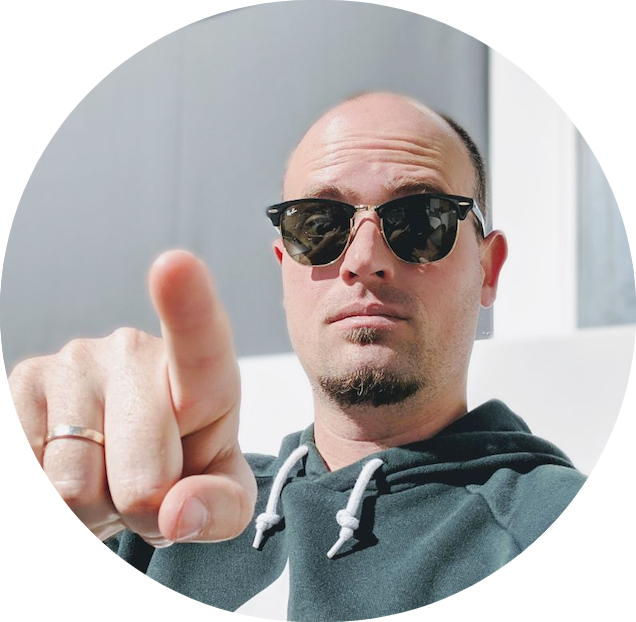

I'm a software developer born in Spain and living in the Netherlands since 2015. Husband to an Amazon and father to four Spartans.

Full stack polyglot, I have professionally developed with a good percentage of the languages out there. In a journey that started with an Android app with a PHP
backend, I've worked with Ruby, C# (both MVC and WebApi), node (express), angular, react and more recently Kotlin with [Ktor](https://ktor.io/) and
[Arrow](https://arrow-kt.io/).

Architecturally speaking I advocate for layered structures and message based communication between verticals.

On deployment strategies I'm more inclined towards distributed systems, but I'm not allergic to monoliths (and yes, you can use a message based communication
in a monolith).

About the eternal war of dynamic vs static types: Static, any day of the week. Having the flexibility of asking a car to fly sounds cool until you are inside
the car and it actually tries to fly.

Quality advocate, refactoring for a living and perpetual boy scout. My philosophy for software construction is: Make your code work, clean it just enough and
always leave any file you touch a little bit cleaner than you found it. Try to avoid refactoring for the sake of refactoring unless your technical debt has
reached a breaking point. 

> My wife truly sees me through a unique lens.

I'm on [Twitter](https://www.twitter.com/jycabello) and [LinkedIn](https://www.linkedin.com/in/jycabello/).
