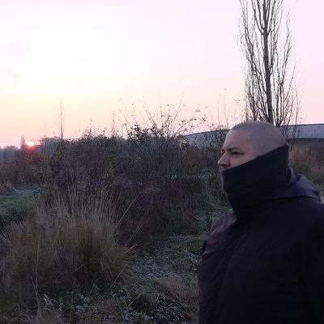

I'm a software developer born in Spain and living in the Netherlands since 2015. Husband to an Amazon and father to four Spartans, two boys and two girls that came out in two twin batches.

Full stack polyglot, I have professionally developed with a good percentage of the languages out there. In a journey that started with an Android app with a PHP backend, I've worked with Ruby, C# (both MVC and WebApi), node (express), angular, react and more recently Kotlin with [Ktor](https://ktor.io/) and [Arrow](https://arrow-kt.io/).

Architecturally speaking I advocate for layered structures and message based communication between verticals.

On deployment strategies I'm more inclined towards monoliths (yes, you can use message based communication in a monolith), but I'm not allergic to distributed systems. I find Kubernetes cool and I enjoy fiddling with dapr, but I'm just more inclined towards the simplest competent solution.

About the eternal war of dynamic vs static types: I used to be willing to die on the static&trade; hill. Nowadays, while I prefer to delegate as much logic to a static type system as I can, I've tried to do enough logic where the type systems becomes a tax that I'm less grumpy about it.

Quality advocate, refactoring for a living and perpetual boy scout. My philosophy for software construction is: Make your code work, clean it just enough and always leave any file you touch a little bit cleaner than you found it. Try to avoid refactoring for the sake of refactoring unless your technical debt has reached a breaking point or you are leveraging technical excellence.

I'm not that clever.

I don't know that much.

> My wife truly sees me through a unique lens.

I'm on [Twitter](https://www.twitter.com/jycabello) and [LinkedIn](https://www.linkedin.com/in/jycabello/).
